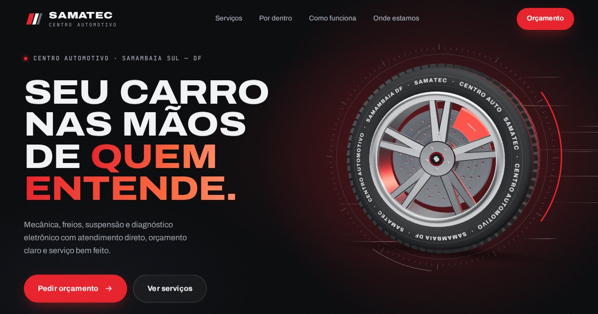

# Demo — Samatec Centro Automotivo

Página premium, com efeitos 3D e motion, feita para a
[@samatecautomotivo](https://www.instagram.com/samatecautomotivo/).
Ela usa um arquivo só (`index.html`), que abre direto no navegador.



## O que a página faz

| Efeito | Onde |
|---|---|
| Roda 3D em tempo real (pneu com letreiro SAMATEC, raios diamantados, disco furado, pinça vermelha) | Topo |
| A roda gira, acelera conforme a pessoa rola a página e inclina seguindo o mouse | Topo |
| Velocímetro "Role e acelere" ligado à velocidade da roda | Topo |
| **Vista explodida**: a roda se desmonta peça por peça (pneu, roda, disco, pinça, suspensão), com etiquetas presas a cada peça | "Por dentro da roda" |
| Loader com conta-giros, títulos que sobem palavra por palavra, faixas cruzadas que aceleram com o scroll | Página toda |
| Cartões de serviço com inclinação 3D, brilho que segue o mouse e ícones que se desenham | Serviços |
| Linha do processo que se preenche com o scroll, botões magnéticos, cursor personalizado e rolagem suave | Página toda |

A página foi testada em desktop (1440 px e 1280 px) e em celular (390 px).
Também foi testada em três situações: sem internet para as bibliotecas,
sem WebGL e com "reduzir movimento" ativado. Sem WebGL ou sem as
bibliotecas, aparece uma roda em SVG e todo o conteúdo continua visível.

## Antes de mostrar ao dono: o que é real e o que falta confirmar

O Instagram não pôde ser lido daqui, então a página usa só o que foi achado
em listas públicas:

- **Endereço:** QN 307, Samambaia Sul, CEP 72305-400. Confirme na ficha do
  Google Maps
- **Serviços:** mecânica geral, freios, suspensão, injeção eletrônica, troca
  de óleo e ar-condicionado. É a lista típica de um centro automotivo.
  **Confira no Instagram dele** e tire o que ele não faz
- **WhatsApp:** não encontrado. Enquanto estiver vazio, todos os botões abrem
  o **Direct do Instagram**, que já funciona
- **Avaliações, nota do Google, anos de mercado e fotos:** ficam escondidos
  até você preencher. Nada foi inventado, seguindo a regra do
  [`gerador/COMO-USAR.md`](../../gerador/COMO-USAR.md)

## Como editar (5 minutos)

Abra `index.html` e procure **`EDITE AQUI`**, logo no começo do `<body>`:

```js
window.SAMATEC = {
  whatsapp: '61 99999-0000',        // os botões passam a abrir o WhatsApp
  horario: 'Seg a Sex 8h às 18h · Sáb 8h às 12h',
  anos: '12', notaGoogle: '4.9', avaliacoes: '230',   // aparece a faixa de números
  depoimentos: [{ nome: 'Fulano S.', texto: 'Avaliação real copiada do Google' }],
  fotos: ['https://...jpg']                            // galeria abaixo do Instagram
};
```

- **Cor da marca:** troque `--ac` em `:root` (hoje `#e8202a`). A cor da pinça,
  da mola e dos detalhes 3D muda junto
- **Logo:** o topo usa um logotipo em texto ("SAMATEC" com três faixas).
  Se ele tiver um logo, troque o `<svg>` dentro de `.brand`

## Como publicar

1. Arraste a pasta (ou só `index.html` + `og.jpg`) em
   [app.netlify.com/drop](https://app.netlify.com/drop)
2. Com o link no ar, abra `index.html` e procure `og:image`. Descomente a
   linha e coloque o endereço completo da imagem (ex.:
   `https://samatec.netlify.app/og.jpg`). Publique de novo. Sem esse passo,
   o link vai sem imagem de prévia no WhatsApp
3. Salve o link em `Link_Demo` no [`crm/pipeline.csv`](../../crm/pipeline.csv)

## Na abordagem

Mostre **no celular** e role devagar até a roda se desmontar. É o momento
"uau" da página. O letreiro do pneu e a pinça com o nome dele são o que faz
o dono sentir que a página já é dele.

## Notas técnicas

- Bibliotecas via CDN (jsDelivr): Three.js r170, GSAP 3.13 + ScrollTrigger e
  Lenis 1.3. Não precisa instalar nada
- A roda é modelada em código, sem arquivo 3D externo. O HTML tem 95 KB
  (27 KB comprimido), e as bibliotecas somam cerca de 220 KB comprimidas
- A cena 3D pausa quando sai da tela. No celular, a resolução e a geometria
  são reduzidas
